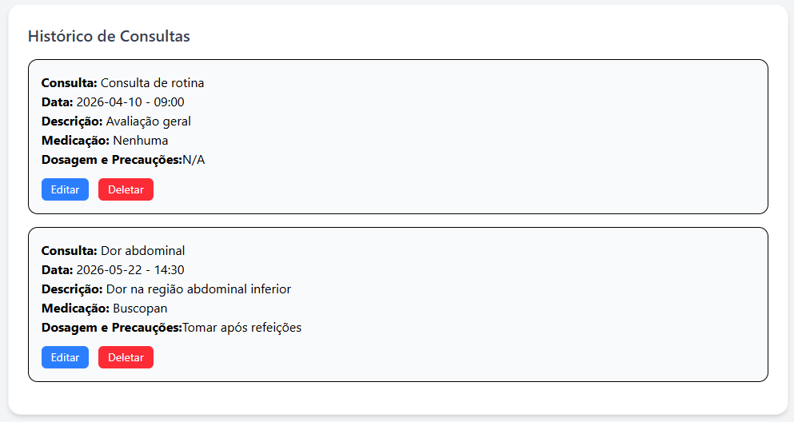
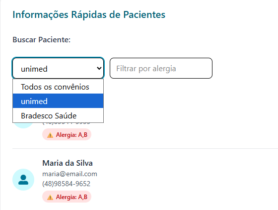
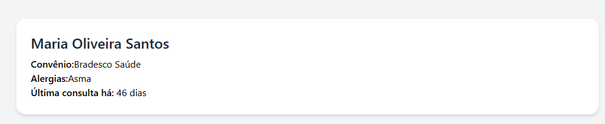
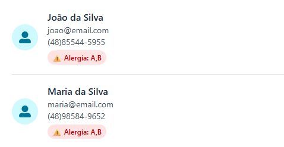

# Relatório de Features — Clínica FullStack (Frontend)

**Projeto:** Clinica FullStack

**Disciplina:** Desenvolvimento de Sistemas

---

## Feature 1 — Ordenação de Consultas e Exames por Data



### Código

```jsx
const sortedConsults = [...consults].sort(
	(a, b) => new Date(a.date) - new Date(b.date),
);

const sortedExams = [...exams].sort(
	(a, b) => new Date(a.date) - new Date(b.date),
);
```

### Explicação

Cria cópias imutáveis dos arrays `consults` e `exams` (spread operator, evita mutar o estado original) e ordena por data crescente convertendo strings para `Date` antes de subtrair. As listas renderizadas (`sortedConsults.map`, `sortedExams.map`) usam os arrays ordenados no lugar dos originais.

---

## Feature 2 — Busca Avançada (Convênio e Alergia)



### Código

```jsx
const insuranceOptions = [
	...new Set(patients.map((p) => p.healthInsurance).filter(Boolean)),
];

const filteredPatients = patients.filter((patient) => {
	const matchesSearch = [patient.fullName, patient.email, patient.phone]
		.join(' ')
		.toLowerCase()
		.includes(searchTerm.toLowerCase());

	const matchesInsurance = filterInsurance
		? patient.healthInsurance === filterInsurance
		: true;

	const matchesAllergy = filterAllergy
		? patient.allergies?.toLowerCase().includes(filterAllergy.toLowerCase())
		: true;

	return matchesSearch && matchesInsurance && matchesAllergy;
});
```

### Explicação

`insuranceOptions` extrai valores únicos de convênio da lista de pacientes (`Set` remove duplicatas) para popular o `<select>` dinamicamente. O filtro combina três critérios com `&&`: busca textual (nome/email/telefone), convênio exato e substring de alergia — todos opcionais (vazio = sem restrição).

---

## Feature 3 — Contador de Dias desde a Última Consulta



### Código

```jsx
const lastConsultDate = sortedConsults.length
	? sortedConsults[sortedConsults.length - 1].date
	: null;

const daysSinceLastConsult = lastConsultDate
	? Math.floor((new Date() - new Date(lastConsultDate)) / (1000 * 60 * 60 * 24))
	: null;
```

### Explicação

Pega a última consulta do array já ordenado por data (`sortedConsults`). Calcula a diferença em milissegundos entre hoje e a data da consulta, convertendo para dias (`1000 * 60 * 60 * 24` ms = 1 dia). Retorna `null` se não houver consultas, evitando exibir dado inválido.

---

## Feature Nova — Badge de Alerta de Alergia



### Código

```jsx
{
	patient.allergies && (
		<span className="inline-block bg-red-100 text-red-700 text-xs font-semibold px-2 py-1 rounded-full mt-1">
			⚠ Alergia: {patient.allergies}
		</span>
	);
}
```

### Explicação

Renderização condicional: se `patient.allergies` existir e não for vazio, exibe badge visual vermelho destacando a alergia diretamente na listagem de pacientes, sem precisar abrir os detalhes. Reduz risco de erro médico por informação não visível.

---

## Ferramentas Utilizadas

- React + Vite
- Tailwind CSS
- Axios / apiClient (instância Axios customizada)
- json-server (mock API)
- Assistência de IA (Claude) para revisão de código e depuração
